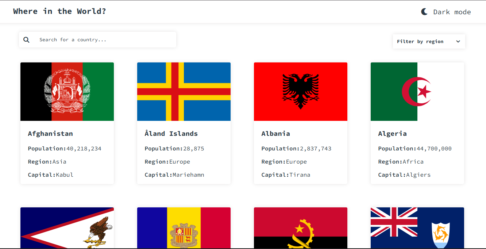

# Frontend Mentor - REST Countries API with color theme switcher solution

This is a solution to the [REST Countries API with color theme switcher challenge on Frontend Mentor](https://www.frontendmentor.io/challenges/rest-countries-api-with-color-theme-switcher-5cacc469fec04111f7b848ca). Frontend Mentor challenges help you improve your coding skills by building realistic projects.

## Table of contents

- [Overview](#overview)
  - [The challenge](#the-challenge)
  - [Screenshot](#screenshot)
  - [Links](#links)
- [My process](#my-process)
  - [Built with](#built-with)
  - [What I learned](#what-i-learned)
  - [Continued development](#continued-development)
  - [Useful resources](#useful-resources)
  - [AI Collaboration](#ai-collaboration)
- [Author](#author)
- [Acknowledgments](#acknowledgments)

**Note: Delete this note and update the table of contents based on what sections you keep.**

## Overview

### The challenge

Users should be able to:

- See all countries from the API on the homepage
- Search for a country using an `input` field
- Filter countries by region
- Click on a country to see more detailed information on a separate page
- Click through to the border countries on the detail page
- Toggle the color scheme between light and dark mode _(optional)_

### Screenshot




### Links

- Solution URL: [https://github.com/Daveed-dev/Countries-App.git]

- Live Site URL: [https://countries-app-allk.vercel.app/]

## My process

### Built with

- Semantic HTML5 markup
- CSS custom properties
- Flexbox
- CSS Grid
- Mobile-first workflow
- [React](https://reactjs.org/) - JS library
- [FontAwewsome](https://fontawesome.com/)
- [ReactRouterDom] (https://www.npmjs.com/package/react-router-dom)

### What I learned

Note:
I recaped om my React, css and Javascript knowledge. I also learnt about navigate in React.

Things I am Proud of:

```css
.proud-of-this-css {
  display: Grid;
  display: Flex;
}
```

```js
const proudOfThisFunc = () => {
  console.log();
};
```

### Continued development

I used React a Javascript library to solve this project. I would love to solve this project with a Javascript framework.

### Useful resources

- [Claude](https://claude.ai/new) - I used Claude to solve bugs i could not solve.
- [ChatGPT](https://www.chatgpt.com) - I used chatgpt to work on my User interface design.

### AI Collaboration

- [Claude](https://claude.ai/new) - I used Claude to solve bugs i could not solve.
- [ChatGPT](https://www.chatgpt.com) - I used chatgpt to work on my User interface design.

- What worked well? What didn't?
  Well when i had an issue or a bug then i share it with Ai. after solving the problem AI tends to either add some layout or some more update on the code it gives which may break my code. So i don't copy code from AI i just understand my errors that i implement the code myself.

## Author

- Website - [Ojekunle David-joy](https://david-joy.vercel.app/)
- Frontend Mentor - [@Daveed-Dev](https://www.frontendmentor.io/profile/Daveed-dev)
- Twitter - [@David_JoyDD](https://x.com/David_JoyDD)

## Acknowledgments

@Syntax

- LinkedIn - [@ajibola-adeyemo](https://ng.linkedin.com/in/ajibola-adeyemo)
